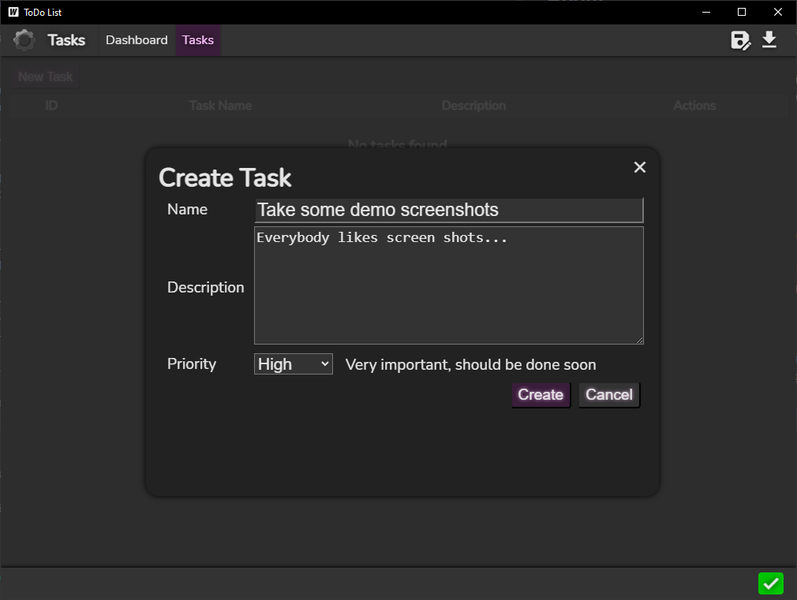
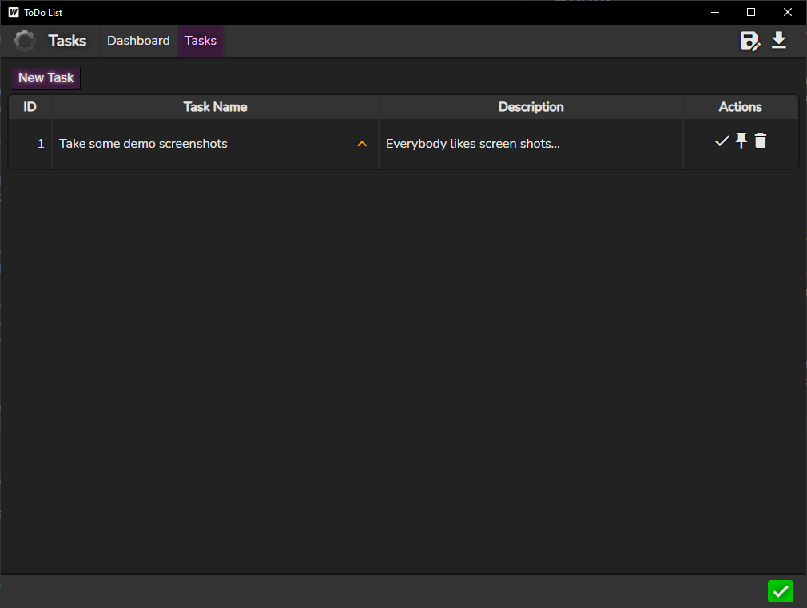
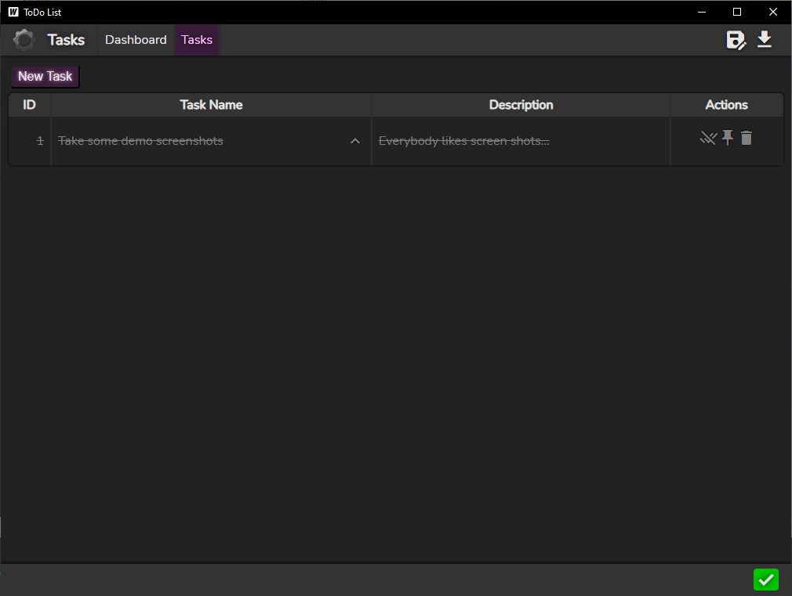
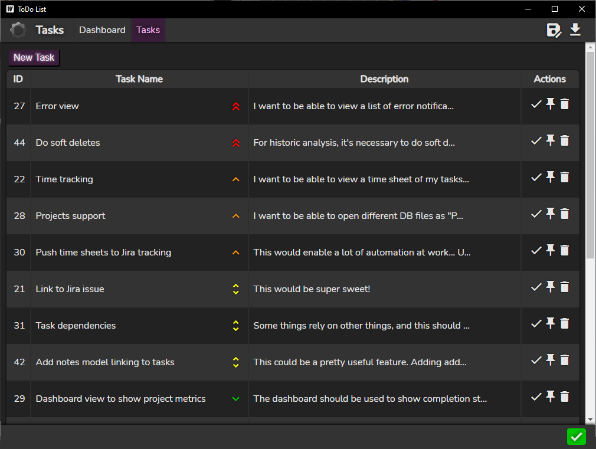

# README

## About

This is based on the official [Wails](https://wails.io/) [Vue template](https://wails.io/docs/community/templates).
It's a TODO list application with minimal dependencies and some bells and whistles (with more to come).

I've wanted to experiment with Wails v2 since it came out, and I figured this would be a good option for a first project.
I'm really enjoying the developer experience, even on Windows, and the quality of life features in the Wails CLI are excellent.

If you have any issues using the application, or you find something that seems like a bug, feel free to open an issue here on [Github](https://github.com/drognisep/todo-list/issues/new).

## Current feature set

* Add, update, delete tasks.
* Assign priority to tasks.
* Pin tasks to the top (favorite tasks will still be priority ordered at the top).
* Mark tasks as complete and reopen them.
* Very basic Dashboard view that just shows the current number of tasks.
  * This is intended to be a place to get at-a-glance metrics about tasks when that data is available.
* Using BoltDB for persistence.
* JSON import/export of task data.
  * Multiple import strategies to choose from.
* Warning/error log available with footer indicators.
  * Clicking on these indicators brings up a log viewer.

## Building

Use the build script at the root of the repository.
Note that it requires that garble be installed to obfuscate the code.

```shell
go install mvdan.cc/garble@latest
```

## Screen shots

Create a task by clicking on the New Task button in the Tasks view.


Filling out the form and clicking on the Create button will add it to your list.


A task can be marked as complete by clicking on the check mark in the Actions column.


Your data can be exported as a *.snapshot file, and then imported later using a few different import strategies.

